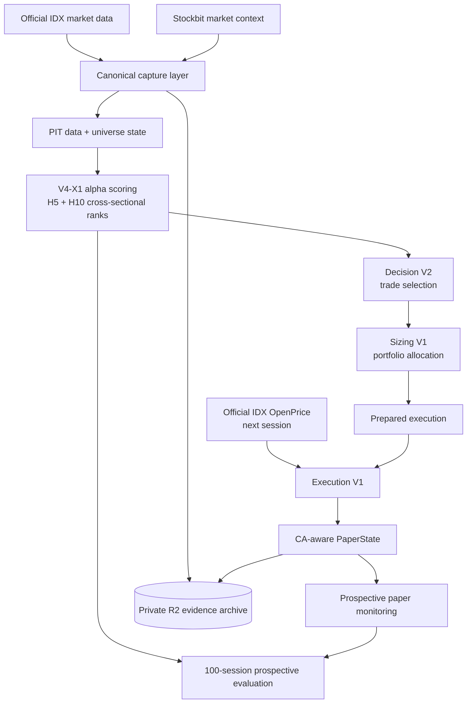
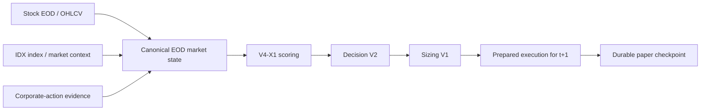
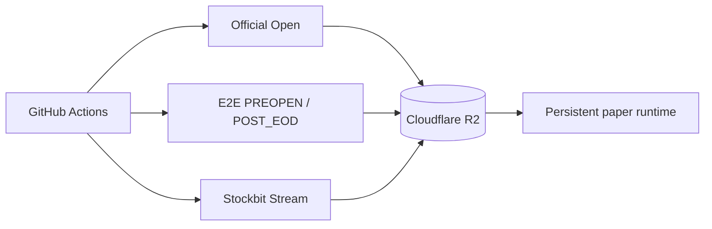

# IDX Trade

[](https://github.com/samindriano/idx-trade/actions/workflows/tests.yml)

**Point-in-time quantitative research and cloud paper-trading infrastructure for Indonesia Stock Exchange (IDX) equities.**

IDX Trade turns market evidence into a daily cross-sectional research signal, a frozen decision/sizing/execution stack, and an auditable prospective paper portfolio. The system is modular by design: data capture, alpha scoring, trade selection, sizing, execution, portfolio state, and evaluation remain separate layers with explicit contracts between them.

> Research software only. Paper-trading and historical results are not evidence of future profitability.

## At a glance

| Layer | Current system |
|---|---|
| Market | IDX equities, Regular Market |
| Research cadence | Daily / EOD cross-sectional ranking |
| Alpha | Frozen **V4-X1** H5/H10 scoring stack |
| Trade selection | **Decision V2** |
| Portfolio sizing | **Sizing V1**, approximately 10% per seat, max 10 seats |
| Execution | **Execution V1**, next-session official IDX `OpenPrice` |
| Portfolio state | Persistent, corporate-action-aware paper state |
| Runtime | Cloud-first GitHub Actions + private Cloudflare R2 |
| Evaluation | Prospective 100-session confirmation separated from model development |

## System architecture



The core idea is simple:

```text
market evidence
    -> point-in-time state
    -> alpha ranking
    -> decision
    -> sizing
    -> prepared execution
    -> official next-session Open
    -> paper portfolio
    -> prospective evaluation
```

The alpha model answers **which eligible names rank highest**. Decision, sizing, and execution answer different questions and are kept independent rather than folded into one end-to-end model.

## Daily paper lifecycle

### 1. Post-close — build tomorrow's decision

After the market closes, the cloud POST_EOD path assembles the canonical EOD market state and prepares the next-session portfolio action.



The EOD Market Capture is one conceptual transaction: stock-level EOD/OHLCV and market/index context belong to the same post-close state rather than separate competing collectors.

### 2. Next morning — observe the executable Open

Official Open Capture runs independently in the cloud and retains the actual IDX `OpenPrice` evidence used by the paper execution path.

```text
09:02 WIB  Official Open capture
09:03 WIB  PREOPEN consumer
09:12 WIB  Open recovery slot
09:13 WIB  PREOPEN recovery
09:22 WIB  final bounded slot
```

The admitted Open is then combined with the prepared execution from the previous EOD cycle:

```text
prepared execution
    + official OpenPrice
    -> Execution V1
    -> fills / pending actions
    -> updated CA-aware PaperState
```

### 3. Forward observation

New paper sessions accumulate without changing the frozen research stack. Evaluation is performed separately over the prospective window so operational evidence does not silently become model-development data.

## Canonical data capture surface

IDX Trade currently recognizes five capture families.

| Capture family | Role | Runtime |
|---|---|---|
| **Official Open Capture** | Execution-grade next-session `OpenPrice` | GitHub Actions -> private R2 |
| **EOD Market Capture** | Stock EOD/OHLCV + IDX market/index context | E2E POST_EOD cloud path |
| **Corporate Action Capture** | Prospective CA evidence for accounting/execution continuity | Integrated with E2E runtime |
| **Stockbit Stream Capture** | Prospective community/market context archive | GitHub Actions -> private R2 |
| **Stockbit Intraday Capture** | Post-close intraday reconstruction/capture | Local runtime; cloud migration in progress |

Foreign flow, reliability/uncertainty, price/trend state, model scoring, Decision, Sizing, Execution, and PaperState are downstream or derived layers, not additional capture systems.

## Research stack

The current project is in **prospective system-validation mode**, not continuous model search.

### Alpha

V4-X1 is the frozen cross-sectional alpha stack used by the current forward system. It produces separate H5 and H10 views and a daily ranking over the eligible universe.

### Decision

Decision V2 converts alpha ranks into a minimal set of portfolio actions. It is deliberately separate from the alpha model so ranking quality and trade-selection policy can be evaluated independently.

### Sizing

Sizing V1 uses a simple seat-based portfolio policy:

- up to 10 positions;
- approximately 10% capital per occupied seat;
- residual cash is allowed when fewer names qualify;
- remaining names are not automatically levered up simply to force 100% exposure.

### Execution

Execution V1 uses the next official IDX Open as the executable reference. Execution state, costs, pending actions, and corporate-action accounting are handled downstream of signal generation.

## Cloud runtime

The default operational direction is cloud-first:



Current deployment state:

- Official Open cloud capture: **active**;
- E2E paper cloud scheduler: **active**;
- Stockbit Stream cloud capture: **active**;
- synthetic full-cloud E2E rehearsal: **passed**;
- first genuine scheduled cloud market-cycle acceptance: **pending**;
- Windows E2E runtime: retained temporarily as fallback until genuine cloud acceptance completes;
- Stockbit Intraday: still the main capture family being migrated off the local machine.

The synthetic rehearsal executes the accepted cloud runtime in a real GitHub-hosted runner, reads the production CloudInputBundle from R2, runs the deterministic five-session synthetic replay, verifies snapshot restore and idempotency, and writes only to an isolated throwaway R2 prefix.

## Operational workflows

| Workflow | Purpose |
|---|---|
| [`official-open-prospective-cloud-capture.yml`](.github/workflows/official-open-prospective-cloud-capture.yml) | Scheduled Official Open capture |
| [`e2e-paper-cloud-orchestration.yml`](.github/workflows/e2e-paper-cloud-orchestration.yml) | Scheduled PREOPEN and POST_EOD paper orchestration |
| [`e2e-paper-cloud-synthetic-rehearsal.yml`](.github/workflows/e2e-paper-cloud-synthetic-rehearsal.yml) | Manual isolated full-cloud rehearsal |
| [`stockbit-stream-prospective-capture.yml`](.github/workflows/stockbit-stream-prospective-capture.yml) | Scheduled Stockbit Stream capture |
| [`tests.yml`](.github/workflows/tests.yml) | Repository test suite |

## Repository map

```text
src/idx_trade/          core data, research, execution, and runtime contracts
config/                 frozen experiment and evaluation configuration
scripts/                reproducible runners, capture entrypoints, and audits
.github/workflows/      cloud schedules and deployment workflows
tests/                  unit, regression, integration, and adversarial tests
docs/checkpoints/       durable research and acceptance checkpoints
docs/artifacts/         promoted manifests and small reproducibility artifacts
docs/repository_hygiene runtime/capture registry and repository hygiene records
coordination/            current lanes, handoffs, and project-wide status
```

Large raw captures, fitted binaries, local runtime state, credentials, and protected forward outcomes are not stored as ordinary Git history. Git retains the code, contracts, hashes, manifests, and small promoted evidence needed to reproduce and audit the system.

## Development

Python **3.11+** is required.

```bash
python -m pip install -e ".[dev]"
python -m pytest
```

For S3/R2 archive tooling:

```bash
python -m pip install -e ".[dev,archive]"
```

Before material changes, check the current coordination ledger and avoid overlapping an active lane:

- [`coordination/TEAM_STATUS.md`](coordination/TEAM_STATUS.md) — live project coordination
- [`coordination/PROJECT_ROADMAP.md`](coordination/PROJECT_ROADMAP.md) — broader roadmap
- [`docs/repository_hygiene/CAPTURE_RUNTIME_REGISTRY_V1.md`](docs/repository_hygiene/CAPTURE_RUNTIME_REGISTRY_V1.md) — canonical capture/runtime map

## Design principles

**Point-in-time by construction.** Historical and prospective decisions are built only from information available at their declared cutoff.

**Modular research.** Alpha, decision, sizing, execution, accounting, and evaluation remain independently inspectable.

**Immutable operational evidence.** Cloud capture and paper-runtime artifacts are hash-bound and retained in durable object storage.

**Research and forward evaluation stay separate.** The incumbent stack is frozen while prospective evidence accumulates; new hypotheses belong to new research lanes rather than silent edits to the running system.

## Scope

IDX Trade currently focuses on:

- Indonesia Stock Exchange equities;
- Regular Market execution assumptions;
- daily/EOD cross-sectional research;
- paper trading before any real-money automation;
- reproducible market-data capture and forward evaluation.

The repository is a research and engineering project, not a brokerage or investment-advice product.
