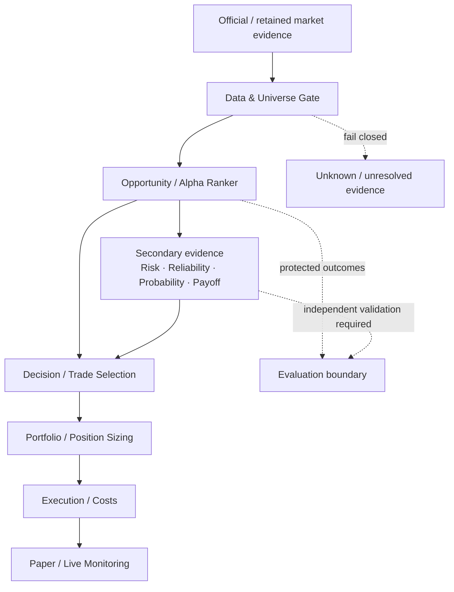
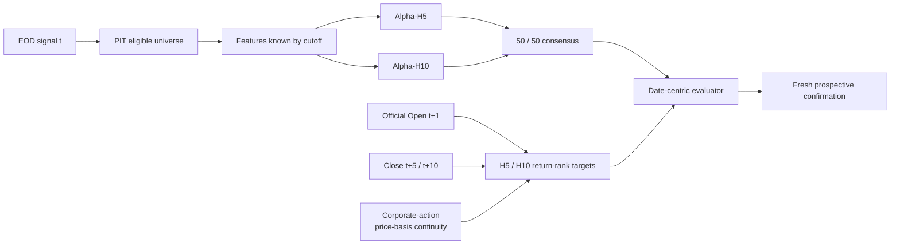

# IDX Trade

Point-in-time research infrastructure for **Indonesia Stock Exchange (IDX) equities**.

IDX Trade is built around one principle: **data validity, alpha, risk, decision rules, sizing, execution, and validation are different problems and should stay separate.** The repository is designed to make each layer auditable before it is allowed to influence the next one.

> Research software only. Historical-development results are not evidence of live profitability.

## System map



The architecture intentionally avoids an all-in-one model. A useful ranker does not automatically imply a valid risk model, sizing rule, or execution policy.

```text
Opportunity != Path Risk != Probability != Payoff != Decision != Sizing != Execution
```

## Current research track — V4

The old ranking lineage has been forensically closed. The current research track is **V4**, which redesigns the decision, target, and evaluation contracts around executable timing and date-centric validation.



### V4 contract in brief

- Signal information is frozen after official EOD session `t`.
- The earliest executable reference is **official Open(t+1)** — never Close(t).
- Forecast horizons are H5 and H10:
  - `R5 = Close(t+5) / Open(t+1) - 1`
  - `R10 = Close(t+10) / Open(t+1) - 1`
- Raw forward returns are converted into **same-date cross-sectional percentile ranks**.
- H5 and H10 are modeled separately; consensus is frozen at `0.5 × H5 + 0.5 × H10`.
- Evaluation is **date-centric**, not pooled-row-centric.
- The historical-development validation block is frozen as **6 × 100 consecutive eligible signal sessions** with H10-aware purge.
- Target observability and price-basis continuity are hard gates. Missing or ambiguous evidence is not silently filled.
- Passing historical-development gates would still require a **fresh prospective confirmation** before deployment claims.

## Current status

_As of 2026-08-18._

| Area | Status |
|---|---|
| PIT security master / listing-state controls | Established |
| Primary-liquid V4 universe + frozen 6×100 validation identity | Frozen |
| Historical Open support | Accepted for the frozen V4 support path |
| V4 decision / target / evaluation contracts | Frozen |
| V4 runtime + execution code | Prefit accepted |
| Corporate-action price-basis continuity | **Current hard blocker** |
| KSEI CA-history coverage | Targeted gap remediation in progress |
| V4 R5 / R10 target materialization | **Not run** |
| V4 model fit / predictions / IC / Top30 performance | **Not run** |
| Protected / fresh-forward V4 outcomes | **Not accessed** |

The current blocker is deliberately upstream of model fitting: V4 does not materialize its research targets until the corporate-action continuity gate is defensible.

## Historical lineage

Earlier ranking generations remain useful as research history, but their interpretation is constrained by later forensic work.

- **Clean V2 `HGB_XS_MARKET`** is retained as a **clean contextual historical benchmark under the old target contract**.
- Older V1 / V3-B / O2 work is retained for lineage, diagnostics, and lessons learned — not as proof of executable V4 edge.
- The old binary barrier target conditioned on future barrier resolution and used a non-executable Close(t) reference; V4 was designed specifically to remove those contract problems.
- Failed candidates and blocked data hypotheses are preserved rather than deleted after the fact.

## Scientific guardrails

### Point-in-time first

The universe is dynamic. Current survivors are never backfilled into the past, and listing state is applied before sequential feature construction.

### Fail closed

Unknown evidence stays unknown. Examples:

- missing provider row ≠ suspension;
- Record Date / Distribution Date ≠ automatic market price-basis transition;
- unresolved corporate-action identity ≠ harmless event;
- unavailable Open ≠ synthetic Close fallback.

### Execution prices stay raw

Observed `raw_*` OHLC values are the execution layer. Vendor-adjusted series may be retained as separate information, but adjusted prices are never substituted for fills, stops, gaps, or target references.

### Outcomes are gated

Research contracts are frozen before outcome access. Bugs may be fixed; a failed hypothesis may motivate a **new preregistered generation**; the existing contract is not rescued post hoc.

### Evaluation follows the decision unit

The product makes one cross-sectional decision per signal date, so V4 evaluates daily cross-sectional behavior rather than allowing dates with more rows to dominate pooled metrics.

## Data-state model

Existence state:

- `NOT_LISTED`
- `LISTED`
- `DELISTED`

Tradability is tracked separately and market-specifically:

- `ACTIVE`
- `SUSPENDED`
- `FCA_WATCHLIST`
- `NO_TRADE`
- `UNKNOWN`

Provider availability is separate again:

- `PRESENT`
- `ABSENT_UNRESOLVED`
- `DATA_MISSING`

These concepts are intentionally not collapsed into one boolean eligibility flag.

## Repository layout

```text
src/idx_trade/        scientific and data-contract implementation
config/               frozen experiment / data-policy configuration
scripts/              reproducible runners and audit entrypoints
tests/                unit, regression, and adversarial tests
docs/checkpoints/     scientific decisions, results, blockers, acceptance notes
docs/artifacts/       small promoted manifests / summaries / reproducibility artifacts
coordination/          cross-lane claims, handoffs, and repository-wide status
```

Large raw provider captures, full panels, runtime environments, fitted binaries, credentials, and protected outcomes are intentionally kept outside normal Git history. Git stores the reproducibility contract: code, hashes, manifests, provenance, and small accepted artifacts.

## Working conventions

Before material work:

1. read the latest `main:coordination/TEAM_STATUS.md`;
2. check active lanes;
3. claim a non-overlapping branch/lane;
4. freeze the relevant contract before accessing outcomes;
5. preserve exact input/output hashes and failure states;
6. stop at the declared review boundary.

The repository treats negative results as first-class research output. A failed experiment is generally cheaper than an unverifiable success.

## Scope

- Market: IDX equities.
- Initial execution venue: Regular Market.
- Primary timeframe: daily / EOD.
- Research universe: dynamic and point-in-time.
- Initial objective: defensible cross-sectional opportunity ranking, then independently validated decision and execution layers.

---

For the live cross-project state, blockers, active owners, and exact branch anchors, see [`coordination/TEAM_STATUS.md`](coordination/TEAM_STATUS.md).
