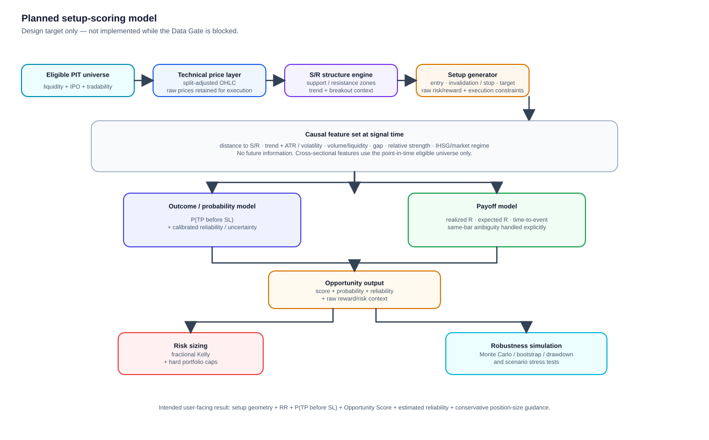

# IDX Trade Research

Personal research project for building a point-in-time, daily/EOD IDX trade-setup scoring and risk engine.

## Architecture at a glance

### Current system

This is the architecture that exists today. The project is deliberately **data-first**: modelling remains disabled until the historical Data Gate can be defended without guessing tradability state.

  

### Planned scoring model

The modelling path below is the target after the Data Gate passes. It is shown here to make the intended research product explicit; these components are **not yet treated as implemented model results**.

  

In practical terms, the intended user-facing output is not a blind BUY/SELL call. It is a structured setup containing the detected price geometry, entry/invalidation/target, risk-reward, estimated `P(TP before SL)`, an Opportunity Score, estimate reliability, and conservative sizing / robustness information.

## Research scope (locked for V1 data foundation)

- Market: Indonesia Stock Exchange (IDX) equities.
- Initial execution venue: **Regular Market**.
- Timeframe: daily/EOD only.
- The research universe is point-in-time and dynamic; current survivors must never be backfilled into the past.
- Raw OHLC prices are execution prices and are never overwritten by adjusted prices.
- Missing price rows are not interpreted as suspensions or no-trade sessions.
- Listing state, market-specific tradability state, and provider-data availability are separate concepts.
- FCA/watchlist securities are excluded from the initial trade universe but may remain in the historical data store.
- Historical delisted securities remain in the historical universe before their effective delisting date.
- IPOs use an explicit warm-up state before becoming model-eligible.
- Model work must not begin until the data gate passes.

## Canonical state model

Existence:

- `NOT_LISTED`
- `LISTED`
- `DELISTED`

Tradability is resolved **per IDX market** (`REGULAR`, `CASH`, `NEGOTIATED`, or `ALL` fallback):

- `ACTIVE`
- `SUSPENDED`
- `FCA_WATCHLIST`
- `NO_TRADE`
- `UNKNOWN`

An exact market-specific interval overrides an `ALL` interval. This matters because IDX can open or suspend different markets differently.

Provider availability is separate again:

- `PRESENT`
- `ABSENT_UNRESOLVED`
- `DATA_MISSING`

A missing Yahoo/provider row is therefore never enough evidence to infer either `SUSPENDED`, `NO_TRADE`, or even confirmed `DATA_MISSING`.

## Price semantics

The codebase keeps distinct price layers:

1. `raw_*`: actual observed OHLC used for execution, gap, stop and target evaluation.
2. `vendor_adj_close` / `vendor_total_return_factor`: vendor-adjusted information retained separately. It is never used as an execution price.
3. Split-adjusted technical prices are intentionally **not** synthesized from `Adj Close`, because that factor may also include distributions/dividends. They must be built from explicit split events when split-event coverage passes the data gate.

## Current V2 foundation

Implemented:

- explicit existence/tradability/provider-state contracts;
- market-specific tradability intervals;
- current IDX listing + historical delisting reference adapters;
- Yahoo daily adapter with `auto_adjust=False`;
- canonical raw OHLCV preserving execution prices;
- point-in-time dynamic liquidity universe;
- expected-vs-observed session coverage gate;
- IPO warm-up eligibility;
- historical provider-revision conflict detection;
- environment/source/data provenance manifest helpers;
- official IDX suspension/resumption PDF ingestion from an auditable manifest;
- parser/compiler diagnostics with document hashes and parser version;
- fail-closed handling for negotiated-only intraday changes and later-session/Periodic Call Auction resumptions;
- versioned adversarial QA catalog covering normal, IPO, suspension, delisted and data-quality stress cases;
- adversarial Data Gate runner and family-level results;
- regression tests + GitHub Actions workflow.

Still blocked before modelling:

- historical discovery/backfill proving a usable Regular-Market tradability coverage window;
- explicit split/dividend/corporate-action verification over the chosen research period;
- price backfill and adversarial Data Gate execution on actual historical data;
- full-universe Data Gate after the adversarial suite passes.

A clean announcement-parser run does **not** mean suspension history is complete. The ingestion report deliberately keeps `coverage_complete=false` until source-discovery completeness is separately justified.

Not migrated intentionally:

- V1 anomaly-score weights;
- fixed five-session `BULLISH/BEARISH/NEUTRAL` target;
- old overloaded `confidence` field;
- old financial backtest;
- old current-active pilot selection;
- old row-count coverage gate;
- old forward monitor until its outcome/execution semantics are redesigned.

See `docs/V2_MIGRATION_AUDIT.md` for the audit-to-migration map and `docs/DATA_GATE_RUNBOOK.md` for the execution sequence.

## Data gate

Before ML/model development, the data layer must demonstrate:

- listing interval correctness;
- Regular-Market suspension/resumption intervals for an audited coverage period;
- explicit `UNKNOWN` when tradability reconstruction is incomplete;
- IPO warm-up behaviour;
- delisted history retained before delisting;
- no silent forward-filling across suspension/no-trade periods;
- corporate-action provenance;
- expected-vs-observed exchange-session coverage;
- internal gap detection;
- provider absence distinguished from exchange trading state;
- explicit corporate-action and price-semantics verification flags;
- reproducibility manifest for code, config, dependency environment and source snapshots.

`UNKNOWN` is a gate failure, not permission to guess. If an ambitious 2009-present period cannot be reconstructed reliably, the research period must be shortened rather than weakening the gate.

## Migration policy

This repository selectively ports infrastructure ideas from `market-movement-analyzer`, but the modelling core is new. The old repository remains a reference implementation only.
