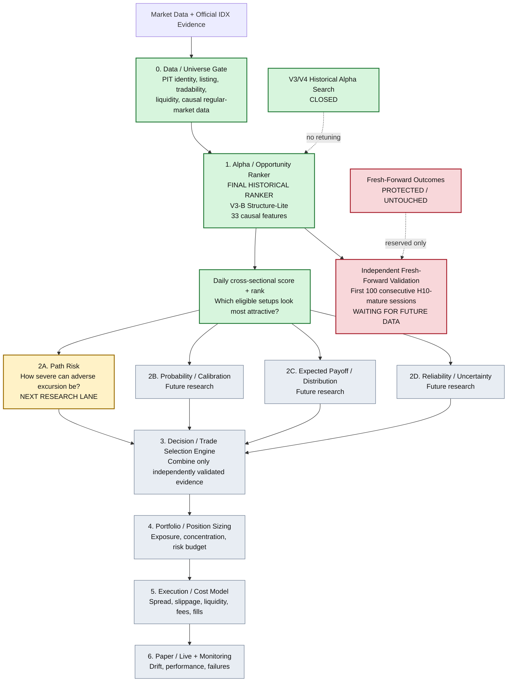
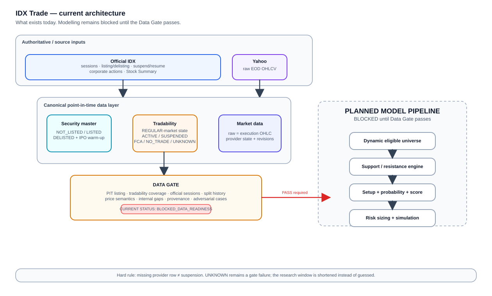

# IDX Trade Research

A modular, point-in-time research system for turning daily/EOD Indonesia Stock Exchange (IDX) data into **opportunity ranking, risk characterization, trade selection, portfolio decisions, execution research, and eventually paper/live monitoring**.

The core idea is deliberately **not** to build one giant model that tries to do everything. IDX Trade separates each question into its own layer so that alpha, risk, probability, sizing, and execution can be researched and validated independently.

## Project map



## The project in one sentence

**First make sure the stock/session is defensible to score, then rank opportunities, characterize their risk and uncertainty, combine only validated evidence into trade decisions, size the portfolio, model execution, and only then move toward paper/live operation.**

## What each layer is responsible for

### 0. Data / Universe Gate

This is the foundation. A stock/session must first be defensible from a point-in-time perspective before any model is allowed to score it.

The data layer separates:

- listing/existence state;
- market-specific tradability state;
- provider-data availability;
- official IDX sessions;
- raw execution OHLCV semantics;
- dynamic liquidity eligibility;
- corporate-action provenance;
- missing/unknown evidence.

A missing provider row is never automatically interpreted as a suspension or no-trade session.

### 1. Alpha / Opportunity Ranker — current core model

The current final historical-development ranker is:

`V3-B-STRUCTURE-LITE-V1-CANDIDATE-005`

Its job is **not** to output a blind BUY/SELL instruction. It ranks the eligible IDX universe cross-sectionally:

> Among the setups available today, which ones look relatively more attractive under the frozen H10 research objective?

The final ranker combines the frozen V2 `HGB_XS_MARKET` information set with eight causal Structure-Lite price-geometry features. The historical architecture search is closed; later V4 challengers did not earn promotion.

The exact final model has also received one frozen historical refit. This is still **historical-development evidence**, not independent future validation.

### Fresh-forward validation — protected branch

The ranker still needs true future evidence.

Its first independent verdict is reserved for the first exact **100 consecutive H10-mature official signal sessions strictly after 2026-07-31**.

Until that full block exists and is explicitly authorized:

- fresh-forward outcomes remain untouched;
- no interim peek is allowed;
- the ranker must not be retuned in response to future results.

### 2. Secondary models — enrich the opportunity, do not replace it

The next research lane is **Path Risk**.

Path Risk asks a different question from the ranker:

> If this setup is attractive, how severe might the adverse price path be before the setup resolves?

A future candidate can therefore look like:

```text
Ticker               BBCA
Alpha rank percentile 94
Path Risk q75          0.42 R
Probability            not yet validated
Expected payoff        not yet validated
Reliability            not yet validated
```

Path Risk is **not automatically a second screening gate**. A rule such as `risk > 0.8R => reject` would itself be a new decision hypothesis that must be preregistered and tested.

Other secondary lanes may later include:

- calibrated probability;
- expected payoff / return distribution;
- reliability / uncertainty;
- other risk dimensions with defensible targets and provenance.

### 3. Decision / Trade Selection Engine

This is the future layer where independently validated evidence can be combined into a real selection policy.

Conceptually:

```text
Alpha Rank
    +
Path Risk
    +
Probability / Payoff / Reliability
    +
Operational constraints
    ↓
Trade Selection
```

The rule must not be invented post hoc by searching whichever historical combination looks best.

### 4. Portfolio / Position Sizing

Once trade selection itself is defensible, the system can research:

- maximum positions;
- exposure and concentration;
- risk budgets;
- diversification constraints;
- sizing rules;
- Kelly-style sizing only if probability/payoff semantics eventually justify it.

### 5. Execution / Cost Layer

A promising model is not automatically a profitable trading system. This layer models the market mechanics needed to translate research signals into realistic trades:

- spread;
- slippage;
- liquidity;
- fees;
- order/fill assumptions;
- execution feasibility.

### 6. Paper / Live + Monitoring

Only after upstream evidence is defensible should the project move toward:

- paper trading;
- live deployment;
- data-quality monitoring;
- model drift;
- signal/performance monitoring;
- failure and provenance logging.

## Current project position

| Layer | Status |
|---|---|
| Data / Universe foundation | **Built / research foundation established** |
| Alpha Ranker | **Frozen final historical ranker: V3-B Structure-Lite** |
| Historical alpha search | **Closed** |
| Final historical refit | **Done** |
| Independent fresh-forward validation | **Waiting for future data** |
| Path Risk | **Next research lane** |
| Probability / Expected Payoff / Reliability | Not started |
| Decision engine | Not started |
| Portfolio / sizing | Not started |
| Execution / costs | Not started |
| Paper / live | Not started |

## Architectural rule

The project should remain modular:

```text
Opportunity != Path Risk != Probability != Payoff != Sizing != Execution
```

A secondary model can fail without reopening the alpha ranker. Conversely, a useful secondary model does not automatically earn permission to filter trades, alter ranking, or change position sizes.

That separation is one of the main safeguards against turning IDX Trade into an overfit all-in-one model.

---

## Data foundation architecture

The diagram below shows the lower-level data foundation that underpins the higher-level ecosystem above.

<p align="center">
  
</p>

## Research scope

- Market: Indonesia Stock Exchange (IDX) equities.
- Initial execution venue: **Regular Market**.
- Timeframe: daily/EOD only.
- The research universe is point-in-time and dynamic; current survivors must never be backfilled into the past.
- Raw OHLC prices are execution prices and are never overwritten by adjusted prices.
- Missing price rows are not interpreted as suspensions or no-trade sessions.
- Listing state, market-specific tradability state, and provider-data availability are separate concepts.
- FCA/watchlist securities are excluded from the initial trade universe but may remain in the historical data store.
- Historical delisted securities remain in the historical universe before their effective delisting date.
- IPOs use an explicit warm-up state before becoming model-eligible.

## Canonical state model

Existence:

- `NOT_LISTED`
- `LISTED`
- `DELISTED`

Tradability is resolved **per IDX market** (`REGULAR`, `CASH`, `NEGOTIATED`, or `ALL` fallback):

- `ACTIVE`
- `SUSPENDED`
- `FCA_WATCHLIST`
- `NO_TRADE`
- `UNKNOWN`

An exact market-specific interval overrides an `ALL` interval. This matters because IDX can open or suspend different markets differently.

Provider availability is separate again:

- `PRESENT`
- `ABSENT_UNRESOLVED`
- `DATA_MISSING`

A missing Yahoo/provider row is therefore never enough evidence to infer either `SUSPENDED`, `NO_TRADE`, or even confirmed `DATA_MISSING`.

## Price semantics

The codebase keeps distinct price layers:

1. `raw_*`: actual observed OHLC used for execution, gap, stop and target evaluation.
2. `vendor_adj_close` / `vendor_total_return_factor`: vendor-adjusted information retained separately. It is never used as an execution price.
3. Split-adjusted technical prices are intentionally **not** synthesized from `Adj Close`, because that factor may also include distributions/dividends. They must be built from explicit split events when split-event coverage passes the data gate.

## Research lineage

The project selectively ports infrastructure ideas from earlier Indonesian-stock research, but the current modelling core is rebuilt under stricter point-in-time, provenance, bounded-search, and outcome-access rules.

The historical experiment record intentionally retains failed candidates and blocked data hypotheses rather than deleting them after the fact.
