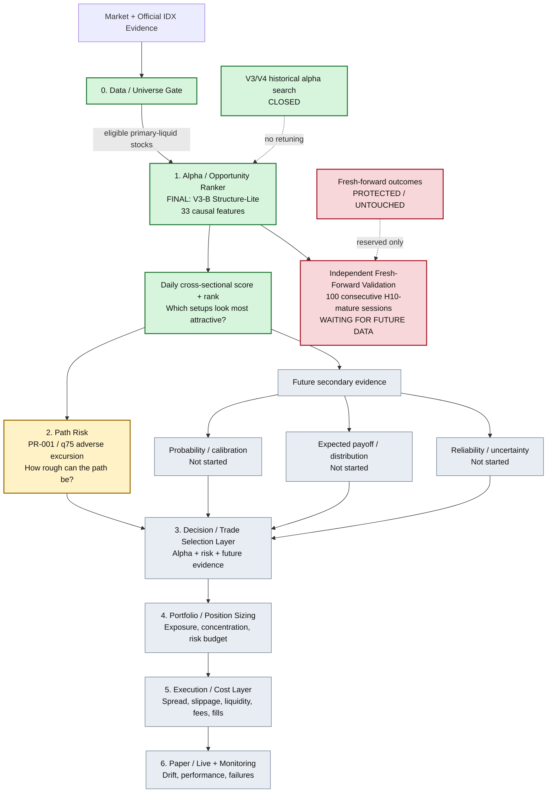

# IDX Trade — Model Ecosystem Overview

Date: 2026-08-10 (Asia/Jakarta)

This document is the high-level map of how the research components are intended to fit together. It is deliberately simpler than the experiment ledgers: use it to understand **what each layer is responsible for**, what is already frozen, and what remains research-only.

## System graph



## How to read the graph

### 0. Data / Universe Gate — foundation

This determines whether a stock/session is defensible to score at all: PIT identity/listing evidence, official-session/tradability semantics, causal regular-market data, liquidity, and the existing primary-liquid universe contract.

A provider row existing or missing is not itself a tradability state.

### 1. Alpha / Opportunity Ranker — **locked**

Final historical-development ranker:

`V3-B-STRUCTURE-LITE-V1-CANDIDATE-005`

It combines the frozen V2 `HGB_XS_MARKET` information set with eight frozen causal Structure-Lite features. Its job is **cross-sectional opportunity ranking**:

> Among eligible IDX stocks today, which setups look relatively more attractive under the frozen H10 research objective?

It is not a calibrated TP probability, expected return, position size, or BUY/SELL rule.

Ranking architecture search is closed. V4 produced no survivor. The exact ranker has already received one final historical training refit through signal session `1250`, with sessions `1225..1250` used for training only and not inspected as another validation slice.

### Independent fresh-forward branch — **protected**

The final ranker still needs genuine future validation. The first verdict is reserved for the first exact 100 consecutive H10-mature official signal sessions strictly after `2026-07-31`.

Until the complete immutable block exists and receives separate authorization:

- do not inspect fresh-forward outcomes;
- do not write `FORWARD_OUTCOME_ACCESS_STARTED`;
- do not change the ranker in reaction to future results.

### 2. Path Risk — **next separate research lane**

Path Risk does not try to find more alpha. It asks:

> Conditional on the same causal setup information, how severe can adverse price movement be before the H10 setup resolves?

Path Risk V1 is frozen as one q75 adverse-excursion experiment using the exact 33 ranker features as inputs but a different target. It is a risk characterization layer, not a second-stage trade filter yet.

A future example output could look like:

```text
Alpha rank percentile : 94
Path Risk q75         : 0.42 R
```

That does **not** yet imply a rule such as `risk > 0.8R => reject`. Any alpha+risk decision rule must be separately preregistered and tested.

### 3. Decision / Trade Selection — future

This is where independently validated evidence may eventually be combined into an actual selection policy. Examples of inputs may include alpha rank, Path Risk, calibrated probability, expected payoff, uncertainty, diversification constraints, and operational restrictions.

This layer must not be invented post hoc from whichever historical combination looks best.

### 4–6. Portfolio, execution, paper/live — future

Only after the upstream evidence is sufficiently defensible should the project research:

- portfolio construction and concentration;
- sizing / risk budgets;
- transaction costs, slippage, liquidity and fill assumptions;
- paper trading;
- live monitoring and model/data drift.

Kelly sizing is intentionally deferred until probability/payoff semantics support it.

## Current project position

```text
Data / Universe Gate                 DONE / foundation
Alpha Ranker V3-B                    FROZEN FINAL HISTORICAL RANKER
Final V3-B historical refit          DONE
Independent fresh-forward verdict    WAITING FOR FUTURE DATA
Path Risk V1                         NEXT RESEARCH LANE; OUTCOMES NOT YET VIEWED
Decision engine                      NOT STARTED
Portfolio / sizing                   NOT STARTED
Execution / costs                    NOT STARTED
Paper / live                         NOT STARTED
```

## Architectural rule

The project should remain modular:

`Opportunity != Path Risk != Probability != Payoff != Sizing != Execution`

A secondary model may fail without reopening the final alpha ranker. Conversely, a useful secondary model does not automatically earn permission to alter ranking, filter trades, or change position sizes.

For exact current hashes, experiment outcomes, authorization boundaries, and chronology, see `docs/CURRENT_STATUS.md`, `docs/PROJECT_LEDGER.md`, and the relevant frozen specs/checkpoints.